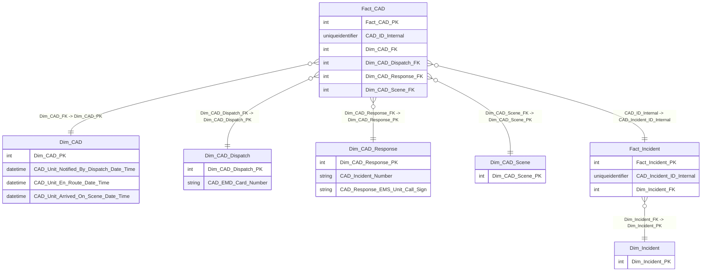

# CAD Reconciliation

This semantic model reconciles CAD data across core CAD fact and dimensions. The diagram below shows the relationships between the CAD tables used by this model. Note: Dim_EMS_CAD is intentionally excluded.

## CAD Tables ER Diagram

### Notes
- Schemas: All CAD tables shown are in `[Elite_DWPortland].[DwEms]`.
- Exclusions: `Dim_EMS_CAD` is intentionally not shown per design request.
- Join keys: The labels on each relationship show the exact FK -> PK mapping used in SQL (see `Semantic Models/CAD Reconciliation/stich.sql`).
